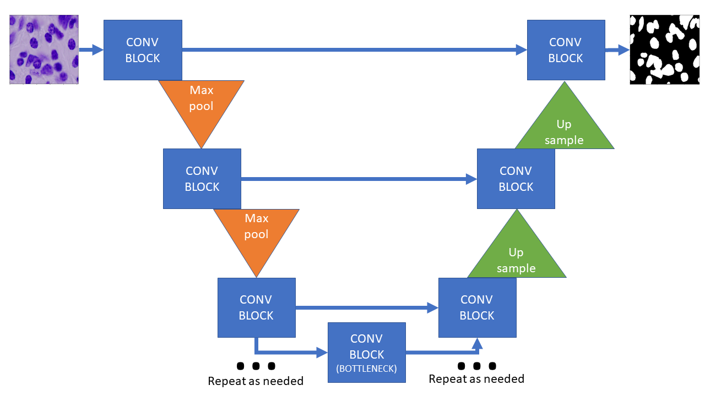
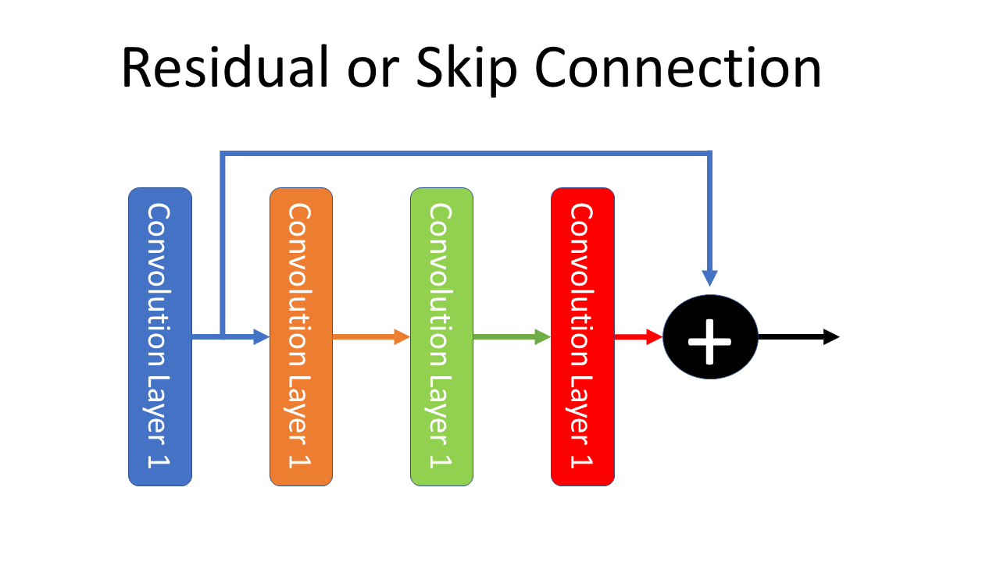
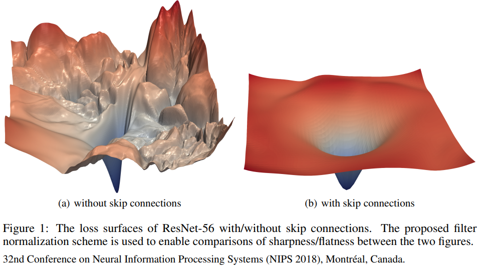
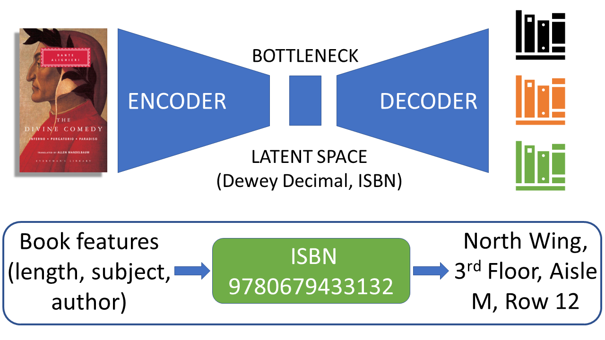

# 2D U-Net for Broad Cell Image Segmentation
A 2D U-Net to segment nuclei from images of cells from the [Broad Bioimage Benchmark Collection](https://bbbc.broadinstitute.org/BBBC038).

### 2D U-Net
## Big idea: Combine encoder/decoder with skip connections

In this notebook, we use a 2D U-Net to train a segmentation model that can segment nuclei from images of cells.

[U-Net](https://en.wikipedia.org/wiki/U-Net) is a [fully-convolutional network](https://arxiv.org/abs/1411.4038) created with an encoder-decoder topology. [Ronnenberger et al.](https://arxiv.org/abs/1505.04597) created the topology in 2015 for use in biomedical imaging.

## Why skip connections?

Residual or skip connections mitigate the vanishing gradient problem and smooth the loss landscape to make training very deep networks possible.

[Hao Li, Zheng Xu, Gavin Taylor, Christoph Studer, Tom Goldstein. Visualizing the Loss Landscape of Neural Nets](https://arxiv.org/pdf/1712.09913.pdf)

## Encoder/Decoders

Encoders/Decoder topologies compress the input space into a smaller, latent space and then expand the latent space back to some output space. It's similar to how we take books and assign (seemingly) random alphanumeric codes to them so that we can organize them properly in a large library.

